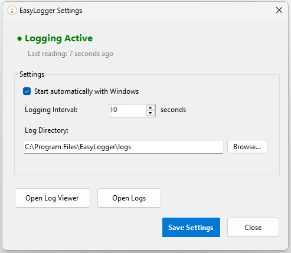
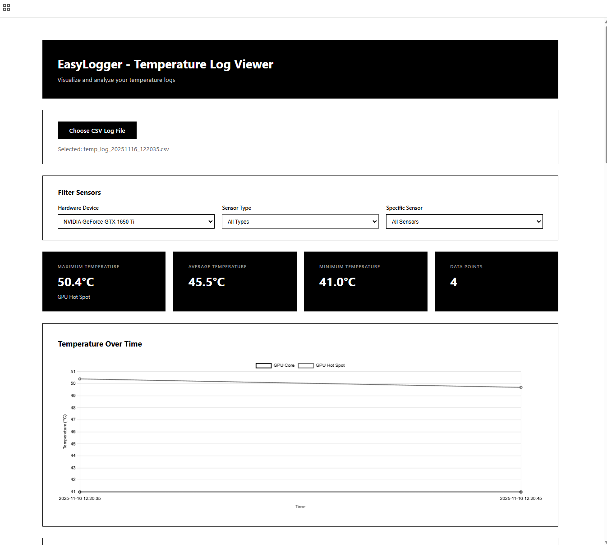

# EasyLogger - Windows Hardware Sensors Logger

An Windows application for monitoring CPU, GPU, and motherboard temperatures to help diagnose system crashes and overheating issues.

Use this app when you want to track logs throughout the entire usage of your computer. Even if it shuts down, you’ll be able to go back to the logs and see what the sensors were showing at that moment.


## Prehistory
My computer started having a lot of issues that I couldn’t track down. I tried several hardware-sensor logging apps and was frustrated by how overly complex they all were and how much useless information they included. It’s just hard to make sense of them. On top of that, most of them don’t support logging, only showing real-time data, or they hide that feature behind a paywall.

It turned out that it was easier to build an app specifically for this myself than to figure out the existing ones.





## Features
- **Windows Forms UI** - Clean settings interface with live status monitoring
- **System Tray Integration** - Runs quietly in the background
- **Direct Hardware Access** - Uses LibreHardwareMonitorLib (no external dependencies)
- **Comprehensive Monitoring** - CPU, GPU, motherboard, fans, power, load
- **Auto-Start** - Optional Windows startup integration
- **Interactive Log Viewer** - Built-in HTML viewer with charts
- **Configurable** - Adjust logging interval and output location
- **Single Executable** - Self-contained, no installation required

## Installation

### Option 1: Windows Installer (Recommended)

1. Download `EasyLogger_Setup_v2.0.exe` from [Releases](../../releases)
2. Run the installer (requires administrator privileges)
3. Choose installation options:
   - ✅ Start automatically with Windows (recommended)
   - Desktop shortcut
4. Launch EasyLogger from Start Menu or system tray

The installer will:
- Install to `C:\Program Files\EasyLogger\`
- Create Start Menu shortcuts
- Set up auto-start (if selected)
- Create logs directory

### Option 2: Standalone Executable

1. Download `EasyLogger.exe` from the `bin/` folder in releases
2. Place it in your preferred location
3. Run as administrator (required for hardware access)

## Usage

### First Launch

1. **Right-click** the EasyLogger executable → **Run as administrator**
2. The app minimizes to the system tray (look for the yellow thermometer icon)
3. **Left-click** the tray icon to open settings

### Settings Window

- **Status** - Shows if logging is active and last reading time
- **Auto-start** - Enable/disable Windows startup
- **Logging Interval** - How often to record data (1-3600 seconds)
- **Log Directory** - Where to save CSV files
- **Open Log Viewer** - View logs with interactive charts
- **Open Logs Folder** - Quick access to log files

### System Tray

- **Left-click** → Open settings window
- **Right-click** → Show menu
  - Settings
  - Open Logs Folder
  - Open Log Viewer
  - Quit EasyLogger

## Output Format

Log files are saved as CSV with the following format:

```csv
Timestamp,Hardware_Device,Sensor_Name,Sensor_Type,Value,Unit
2025-11-16 14:30:00,Intel Core i7-9700K,CPU Core #1,Temperature,45.5,°C
2025-11-16 14:30:00,AMD Radeon RX 6800,GPU Temperature,Temperature,62.0,°C
2025-11-16 14:30:00,Motherboard,System Fan,Fan,1200,RPM
```

### Log File Naming

Files are automatically named with timestamps:
- Format: `temp_log_YYYYMMDD_HHMMSS.csv`
- Example: `temp_log_20251116_143000.csv`
- Location: Default `C:\Program Files\EasyLogger\logs\` (configurable)

## Viewing Logs

### Built-in Log Viewer

1. Click **"Open Log Viewer"** in the settings window
2. Drag and drop your CSV file onto the viewer
3. View interactive charts grouped by hardware device

**Features:**
- 📊 Interactive charts for Temperature, Fan, Load, Clock, Power
- 🔍 Filter by sensor type or specific sensor
- 🖥️ Sensors grouped by hardware device
- 📋 Statistics summary (max, min, average)
- 📱 Works offline - no internet required

### Alternative Analysis Tools

- **Microsoft Excel** - For custom charts and analysis
- **Google Sheets** - For online analysis and sharing
- **Python/Pandas** - For programmatic analysis

## Building from Source

### Requirements

- .NET 8.0 SDK or later
- Windows OS
- Inno Setup 6 (for building installer)

### Build Steps

```bash
# Clone the repository
git clone https://github.com/yourusername/easylogger.git
cd easylogger

# Restore NuGet packages
dotnet restore

# Build release version
dotnet publish -c Release -r win-x64 --self-contained -p:PublishSingleFile=true

# Or use the build script
build.bat

# Build installer (requires Inno Setup)
"C:\Program Files (x86)\Inno Setup 6\ISCC.exe" installer.iss
```

Output:
- Executable: `bin\Release\net8.0-windows\win-x64\publish\EasyLogger.exe`
- Installer: `installer-output\EasyLogger_Setup_v2.0.exe`

## Configuration

Settings are stored in `appsettings.json`:

```json
{
  "Settings": {
    "LoggingInterval": 10,
    "OutputDirectory": "logs",
    "StartMinimizedToTray": true,
    "ShowBalloonNotifications": true
  }
}
```

Changes made through the settings window are saved automatically.

## Command-Line Options

```
EasyLogger.exe [options]

Options:
  -i, --interval <seconds>    Logging interval (default: from appsettings.json)
  -o, --output <directory>    Output directory (default: from appsettings.json)
  -h, --help                  Show help message
```

## Troubleshooting

### "Administrator privileges required" error

EasyLogger needs admin rights to access hardware sensors. Right-click the executable and select "Run as administrator".

### No temperature data / sensors not found

- Ensure your hardware is supported by LibreHardwareMonitor
- Check Windows Device Manager for sensor drivers
- Some virtual machines don't expose hardware sensors

### Auto-start not working

The installer creates a Windows scheduled task. Check Task Scheduler for "EasyLogger" task. You can also toggle auto-start in the settings window.

## Technical Details

- **Language:** C# .NET 8.0
- **UI Framework:** Windows Forms
- **Hardware Library:** LibreHardwareMonitorLib 0.9.3
- **Deployment:** Single-file self-contained executable (~70MB)
- **Installer:** Inno Setup 6
- **Icon:** Custom yellow thermometer design

## Version History

### v2.0 (Current)
- Complete rewrite in C#
- Windows Forms UI with settings window
- System tray integration
- Custom icon
- Professional installer
- Direct hardware access (no external dependencies)
- Auto-start with Windows

### v1.0
- Python-based implementation
- Console application
- Required LibreHardwareMonitor running separately

## License

This project is open-source. LibreHardwareMonitorLib is licensed under MPL 2.0.

## Contributing

Feel free to submit issues or pull requests for improvements.

## Support

For issues, questions, or feature requests, please open an issue on GitHub.
